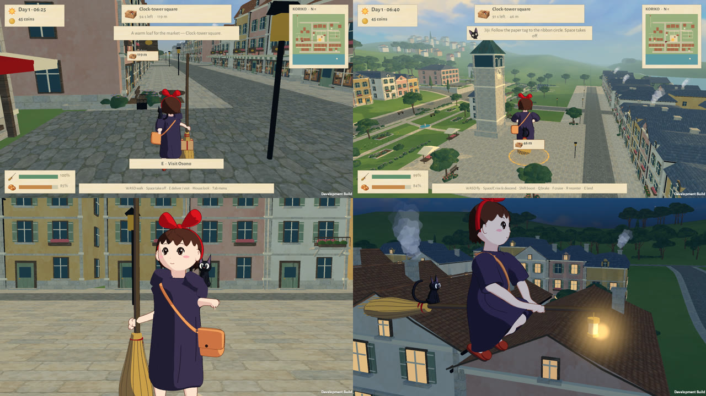

# Film character pass: release 20260930-d88266f

September 30, 2026. This is a dedicated pass on Kiki and Jiji, aiming for the look and feeling of the film: 2D cel shading in the 3D town, with motion that follows the film. Source commit: `d88266f6ed0844c99bd6b0c0c422f58ecb85fa76`. Design notes are in [CHARACTER.md](../../CHARACTER.md#film-character-pass-september-30-2026). The reference was [the official IMAX trailer](https://www.youtube.com/watch?v=e-ENiLJPwDQ). It was downloaded to Omarchy's QA folder for frame study only, and no film frames are stored in the project or shipped.

## Before and after (native captures)

Before, release `9f5ea8f`:
- [standing studies](before/character-9f5ea8f.png): near-black hair, a navy dress, and a small bag and bow that read too large;
- [flight](before/flight-9f5ea8f.png): a knees-up crouch with the dress hanging as a barrel.

After, Apple M1 Pro / Metal: [standing](after-standing.png), [portrait](after-portrait.png), [flight](after-flight.png). In-game, from the tour:

- **Film palette:** auburn hair, dark purple smock, pale cream skin and pink blush, an orange-tan satchel, near-black eyes and a small black Jiji.
- **Cel shading:** every form has one hard shadow shape from a side key light, while the face stays in the lit tone except for a thin far-jaw shadow. The neck is shaded, and the inside of the skirt is filled with its shadow colour.
- **Line work:** colour-matched outlines on every part, sized for 1080p and thinning with distance.
- **Proportions:** about five heads tall; head-sized bow; below-the-knee smock with sleeves to the elbow.
- **Flight:** the film's seated pose. The smock lies over her lap and hangs behind her over the broom, with her flats showing below.
- **Walking** ([every second 24 fps drawing](walk-drawings.png)):
  - the pelvis shifts over the standing leg (this was inverted before);
  - the free arm now opposes the legs, peaking at heel strike instead of mid-stride;
  - the free hand rests on the satchel;
  - the broom is carried close with a bent elbow instead of an arm locked out at shoulder height.
- **Secondary motion:** hair, bow, hem, satchel and Jiji are drawn on twos (12 new drawings a second), while body contact stays smooth. [Takeoff and banks on Omarchy](omarchy-takeoff-and-banks.png).

## Review-driven corrections during the pass

Seven native review rounds caught and fixed:
- **Face:**
  - a painted fringe shadow that showed as pink diamonds between the bangs, because the swept hair edge does not follow a face-space outline; removed;
  - a hard diagonal cel shadow across the face; faces now keep the lit tone.
- **Clothing:**
  - fold lines that read as pinstripes; now a few curved folds;
  - an oversized bow;
  - skin notches at the shoulder seam, because the upper arms under the sleeves were skin-coloured;
  - a hollow tube at the flight hem showing the background between the legs.
- **Pose:** a stiff outstretched free arm.

## Checks

| Suite | Mac: Apple M1 Pro / Metal | Omarchy: RTX 3080 / OpenGLCore |
| --- | --- | --- |
| Character study (carry and flight grips, cloth) | [6 passed](mac/character-result.txt) through the installed Desktop shortcut | Not repeated |
| Polish tour | [33 passed](mac/tour-result.txt) through the installed Desktop shortcut | [33 passed](omarchy/tour-result.txt); 33 again through the installed `kiki-delivery` launcher |
| Controls | [46 passed](mac/controls-result.txt) | [46 passed](omarchy/controls-result.txt) |
| Walking | [17 passed](mac/walk-result.txt); hand 0.0051 m, soles and plants 0.0000 m | [17 passed](omarchy/walk-result.txt) |
| Six-court route | [25 passed](mac/flight-result.txt), 16.93 ms/frame | [25 passed](omarchy/flight-result.txt), 16.87 ms/frame |
| Airborne motion | Not repeated | [10 passed](omarchy/motion-result.txt): 20 smears, 2/24 s longest, banks −21.1°…24.4° |

The 27 core rules checks passed. Mac controls, walking and route ran on the staged candidate, which was built from the same source as the commit; the tour and character study ran again after installation. Frame times are development-player route averages, not benchmarks.

## Installation

- **Mac:** the `9f5ea8f` archive matched its SHA-256 and passed integrity testing before becoming the local rollback, `Builds/mac/previous/Kiki-Delivery-20260930-9f5ea8f-Mac.zip`. The new app passed `codesign --verify --deep --strict`, and its archive passed integrity testing ([metadata](mac-release.json)).
- **Mac disk space:** free space fell to about 400 MB, so the three older Mac archives (`20260928`, `20260929`, `9679e3a`) and a stale 242 MB motion-check output from September 28 were moved to Omarchy under `~/Games/KikiDelivery/archive/`. Each copy was hash-verified before its local file was removed.
- **Omarchy:** all [275 files](omarchy-file-hashes.json) matched after staging and again before `current` switched atomically to `releases/20260930-d88266f` ([metadata](omarchy-release.json)). The earlier releases remain.
- **Saves:** both players' saves were untouched by QA. The Mac save is still dated September 27; the Omarchy save reflects the user's own 15:36 session.
- **VM:** the first Linux export deadlocked at editor startup while another project's Windows build was running on the shared VM; every thread was asleep and the log was silent for 30 minutes. Only our own stalled process was stopped, and the retry built cleanly.

## Limits

- No human play session with this character yet.
- Likeness is judged by eye against the trailer, not measured.
- The character is still a 3D model; its line work and shading imitate cels rather than reproduce hand drawing.
- There are no facial expressions beyond blinks, gaze and the breath mouth.
- No physical-controller test was run.
