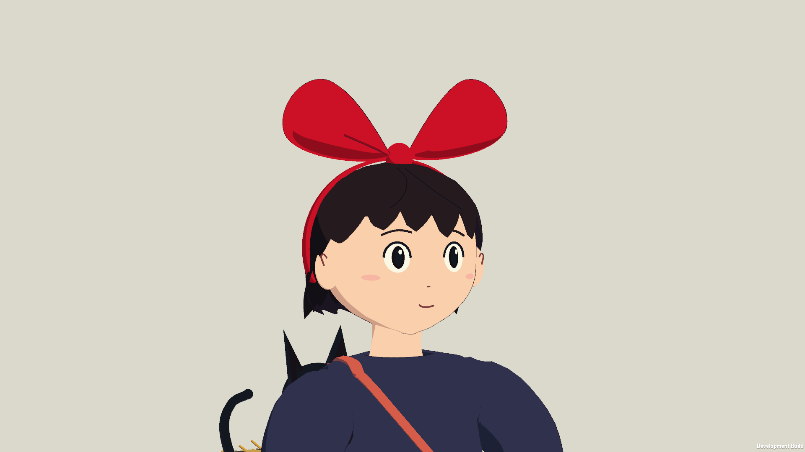

# Kiki character pass — native review

2026-09-27. This pass rebuilds the playable Kiki model against the [official film stills](https://www.ghibli.jp/works/majo/), with the specific reference angles and editable source documented in [the character study](../../CHARACTER.md). All images below are captures from the actual Unity Mac player. Blender source previews are stored separately.

## Character and in-world views

| View | Native capture |
| --- | --- |
| Front, standing | [Front](study/01-front.png) |
| Three-quarter, standing | [Three-quarter](study/02-three-quarter.png) |
| Profile, standing | [Profile](study/03-profile.png) |
| Rear, standing | [Rear](study/04-rear.png) |
| Three-quarter, cruising | [Flight](study/06-flight-three-quarter.png) |
| Profile, cruising | [Flight profile](study/07-flight-profile.png) |
| Rear, cruising | [Flight rear](study/08-flight-rear.png) |

The isolated study uses a neutral background and the game's native character materials and lighting. The cruising poses come from synthetic takeoff and boost input through the real motor, exceeding 20 m/s. These are model-review frames, not a performance benchmark.

The world comparison uses the same camera settings, location and noon time as the previous art pass:

| Previous model | Rebuilt model |
| --- | --- |
| [Before, at the bakery](../film-pass/art/03-kiki-three-quarter.png) | [After, at the bakery](world/03-kiki-three-quarter.png) |

Other in-world views: [normal HUD distance](world/01-bakery-noon-hud.png), [sunset](world/07-bakery-sunset.png), [night](world/08-bakery-night.png).

## Changes and review fixes

- Rebuilt the cheek, jaw and small nose profile. Eyes and facial marks follow the face surface; smaller dark oval eyes, warm skin and restrained cel shadows replace protruding facial parts.
- Rebuilt the continuous bob and swept fringe, visible red headband and softly gathered bow. Multiple source and native reviews removed exposed temples, overlapping hair slabs and overly broad fringe shapes.
- Added a loose navy smock, open sleeve cuffs, fitted salmon bag and straps, low red shoes and finer broom bindings/straw. The grounded height was adjusted for the new feet.
- Added elbow, knee and foot articulation. Both hands follow broom grip targets as the torso leans. The dress and its drawn folds deform over the seated thighs, and the outline shares that deformation.
- Fixed exposed shoulder skin, open-looking knee joints, disconnected strap coverage and internal ink marks at overlapping shoulder surfaces. Kept broad cel color groups and removed shiny rim bands.
- The delivery-route screenshots caught shoes sinking into the floor after the controller settled. Added actual-floor alignment using the visible soles. The first correction exposed a second cause: the broad terrain/deck colliders sat below the visible paving. Added collision on four existing rendered surface assemblies, tightened the editor's delivery-floor tolerance from 1 m to 0.075 m, and extended each landing assertion to check both foot contact and court height. The [expected failing build](landing-review/floor-regression.txt) reproduced the mismatch before the collision fix.
- Refined Jiji's silhouette, front paws and curved tail. The original import orientation anchors remain in use.

The route remains bakery → clock square → harbor → Madame's garden → airship cargo court → bakery. Delivery coordinates, camera, flight controls, player collision dimensions, rendered town geometry and core simulation rules were preserved. Walking-surface collision now matches the existing visible surfaces. This is a character pass for the approved downloadable desktop rebuild.

## Checks completed

The universal Mac development player was built with Unity 6000.3.20f1 / URP 17.3.0 on the existing GPU-less Ubuntu VM. C# compilation, shader compilation, character anchors, required articulation and imported flight-cloth validation passed. The scene validates 77 collision meshes and six landing courts.

Native testing used Apple M1 Pro / Metal, 16 GPU cores and 16 GB RAM, at 1920 × 1080:

- All **six focused character checks** passed: resting grip alignment within 2 cm, imported cloth, real cruising speed, leaning grip alignment within 2 cm, coordinated dress/fold/outline deformation, and supported character shaders. See [exact character results](study/result.txt).
- Eight world viewpoints were captured with supported shaders, including noon, sunset and night. See [exact world-view results](world/result.txt).
- The character and world captures were visually inspected. Passing import or rig assertions alone does not establish film likeness.
- All **23 route checks** passed: the previous 18 checks for delivery, landings, sleep, cooking, purchases, controller input, continuous menu time, save serialization and shaders, plus visible-floor shoe contact at five courts. See [exact route results](flight/result.txt). The final [clock-square](flight/02-clock-square.png), [airship](flight/05-airship-platform.png) and [return-home](flight/06-return-and-rest.png) images confirm the shoes remain visible after landing.
- The sleep assertion now uses a symmetric `1e-7` second tolerance. Its old exact lower bound could fail on decimal subtraction rounding to `99.99999999999999`; the sleep simulation was not changed.
- `codesign --verify --deep --strict` passed for the final app. The universal package contains arm64 and x86_64 executables; runtime tests used arm64 only.
- The refreshed `Builds/mac/Kiki-Delivery-Mac.zip` is 121.8 MiB and passed ZIP integrity verification. The existing desktop shortcut points to the updated app. This remains a local development package, not a notarized public release.

The final 1080p route averaged **18.80 ms per frame**, approximately **53 fps**, with peaks of **1,460 draw calls** and **2,467,194 triangles**. The prior painted-art pass measured 18.55 ms, 1,192 calls and 2,144,426 triangles. These routes include screenshot captures, menus and stops and are not controlled GPU benchmarks. The added character detail has a rendering cost; stable 60 fps and release-build profiling remain open work.

## Scope and remaining work

No production film model or rig was supplied; the new geometry and articulation are original editable project assets. Film stills were inspected as references and are not shipped as character textures. This is a freely viewable 3D interpretation, with simplified facial expression and procedural poses. An expression set and authored flight/landing animation are the next character improvements.

Native runtime evidence is from this Mac only. Physical-controller comfort, human camera/landing playtests, other desktop platforms and mobile/browser builds were not tested in this pass. The previous browser game remains separate. The unchanged core simulation's earlier 25-check result is baseline evidence, not a rerun of this model pass.

Selected rejected early model captures are retained in `first-review/`. The landing images that prompted the ground-contact fix are in `landing-review/`. Neither folder is final evidence.
