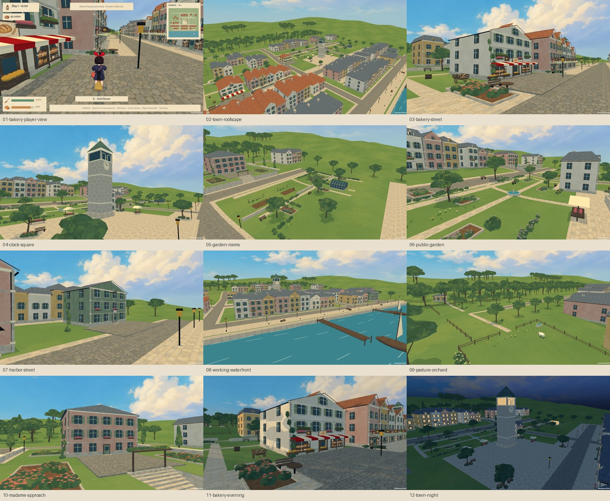

# Environment pass — native verification, 28 September 2026

The Mac prototype now contains the environment pass described in [the art notes](../../ENVIRONMENT.md). The editable Blender source, FBX, generated Unity scene and packaged application contain the same final art. Kiki's FBX, Blender source and `RiderPerformance` were preserved.

## Route and setting

The bakery's red awning anchors takeoff along the shopping street. Narrow joined façades, terracotta and slate roof groups lead toward the clock tower and its open square. The waterfront opens into a promenade and timber piers, while the return through the northern lanes passes cultivated gardens, a greenhouse, pasture and orchard. The delivery court coordinates and flight controls remain unchanged. Ordinary bakery-to-clock cruise covers about 123 metres, before adding takeoff and landing time.

The layout exports **87 building/landmark footprints and 32 paths or circuits**. It includes connected rear service lanes, mixed roof profiles, window trim and balconies, planted garden boundaries, denser woodland edges, a working quay and a stone stair into Madame's raised garden. The minimap consumes those exported paths and footprints.

## Visual reviews and corrections

The first native review is retained in [the bakery view](first-review/03-bakery-street.png) and [the garden view](first-review/05-garden-rooms.png). It exposed several issues that were corrected before the final build:

- An incorrect atlas row boundary admitted timber into foliage and slate into grass. This caused brown crown bands and apparent roads across the distant hills. Pixel sampling established the correct boundaries; the final [garden view](views/05-garden-rooms.png) shows the correction.
- Open gable roof planes needed explicitly upward-facing normals. Gable walls now use plaster beneath roof overhangs, and attic openings on sloping roofs have dormer shells.
- Upper-floor counting left large empty bands on several façades. The bakery, post house and Madame's house now have complete upper stories. Roof-verge and greenhouse framing curves were tightened to their surfaces.
- The older round flower-bed bushes conflicted with the new foliage. Beds and pergola planting now use the same painted leaf masses; climbing ivy has woody connecting stems.
- Madame's original surface path ran into the retaining wall. The terrace now has a stair opening, actual stone steps and a pergola grounded at the top, while the delivery floor remains at its existing height.

All twelve final 1080p native images are in [views](views), including street level, roofscape, park, garden, quay, pasture, sunset and night. The contact sheet above is assembled from those captures. Images in `Docs/previews` are separate Blender authoring previews.

## Completed checks

| Check | Result |
| --- | --- |
| Source building collision clearance | All six landing centers clear |
| Static world batch assembly | 545 material batches; main merge retained 534,712 vertices and 464,455 polygons, with UV and vertex paint preserved |
| Unity Mac development build | Passed; 185 collision meshes; no shader compilation errors |
| Native art review, 1920 × 1080 | Twelve views captured; all scene shaders supported |
| Native art/HUD review, 1280 × 720 | Twelve views captured; HUD and authored minimap visible without overlap |
| Real-control delivery route, 1920 × 1080 | **25 assertions passed**, all six destinations reached |
| Application signature | `codesign --verify --deep --strict` passed |
| Mac package | Universal arm64/x86_64 app; ZIP CRC check passed; 133.0 MiB archive |

The [full route result](flight/result.txt) covers parcel pickup and delivery, low-speed landings, visible shoe contact at the clock square, harbor, Madame's garden, Tombo's workshop, airship and bakery, eight-hour sleep, energy recovery, controller ingredient purchase, cooking/coffee, continuous time, menu scrolling, a broom upgrade, controller takeoff and save serialization.

The route ran natively on **Apple M1 Pro / Metal at 1920 × 1080**, with **17.95 ms mean frame time (about 56 fps)**, 1,846 peak recorded draw calls and 2,869,358 peak recorded triangles. Blender and image/video conversion were not running during that route. This measurement includes the automated route and its captures/menus; it is not a controlled GPU benchmark. The route now visits Tombo as well, so it is not identical to the previous motion-pass measurement.

The 720p [HUD capture](window-720/01-bakery-player-view.png) and [result](window-720/result.txt) are retained. Art-view frame times include screenshot work and should not be read as gameplay performance. These checks use synthetic keyboard/gamepad events through the real input system and flight motor; physical controller hardware and a human playtest were not exercised. Checks use isolated fresh games and do not load or write the player's save.

## Scope and remaining work

References are the project assets and the [official film gallery](https://www.ghibli.jp/works/majo/). The district is an interpretation for this game's flight space, not a reconstruction of the film's exact geography. Original environment meshes and a generated painted surface atlas fill the production-asset gap; no film frames or production meshes are bundled. The [art notes](../../ENVIRONMENT.md) contain the asset path, built-in imagegen mode and full generation prompt.

The tested target is the native Mac prototype. Windows, Intel Mac, mobile and browser builds were not exercised in this pass. Architecture still uses reusable modules, and the distant hills, boats and background activity remain simpler than the main street and garden areas. Further bespoke landmark painting and animated town life would be the next visual work. The current local development app is not a notarized public release.
