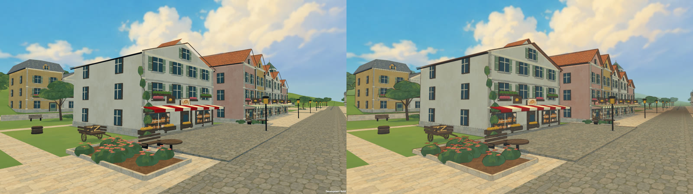
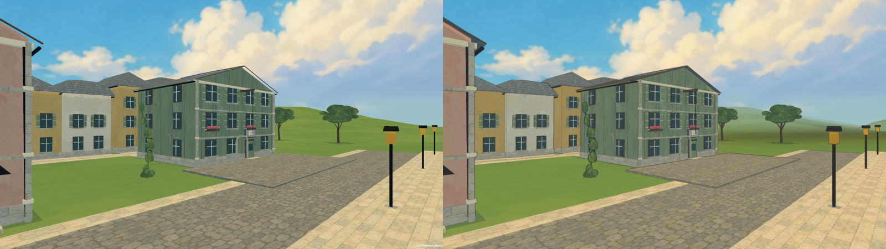

# The film look: native verification, October 2, 2026

Release `20261002-2175792`, built from source commit `2175792` with Unity 6000.3.20f1 as release players (no development watermark). [Design record](../../FILM_LOOK.md). The Mac and Omarchy installations run it, and the same source was packaged for GitHub as v1.0.0 with a Windows player built alongside.

## Before and after

The town, painted in flat washes with hard shadows and the painter's line (left: the September 28 environment pass; right: this release, same viewpoint):

[Four painted views](painted-town.png) (bakery street, garden terraces, harbour street, the square at night) and [four in-game views](in-game.png) (flight with the HUD, walking behind Kiki, the lantern at night, the harbour boats).

## Drawn on twos

[Twelve consecutive 24 fps frames of the walk](walk-consecutive-frames.png): each drawing is exposed for two frames while the street moves beneath her. The planted foot is solved every frame, so it does not slide between drawings; the walking telemetry recorded 0.0000 m of planted-foot displacement and 0.0000 m sole error over the whole reel.

The first run of the drawing clock failed the walk check: with the swing foot held, the foot could plant short of the full step and the stance leg was left overreached as the body walked on, and a held drawing under-estimated the pelvis support a fresh plant needs. [That run's turn frames](first-run-overreach.png) show the lunge. The foot now always plants at the full step and the pelvis support is measured from the drawing's position, and the check passes.

## Checks

| Suite | Mac: Apple M1 Pro / Metal | Omarchy: RTX 3080 / OpenGLCore |
| --- | --- | --- |
| Polish tour | [33 passed](mac/tour-result.txt) at 1280 × 720 and again at 1920 × 1080, and 33 through the installed Desktop shortcut | [33 passed](omarchy/tour-result.txt) on the staged release and 33 through the installed `kiki-delivery` launcher |
| Walking | [17 passed](mac/walk-result.txt): hand 0.0051 m, soles and plants 0.0000 m | [17 passed](omarchy/walk-result.txt) |
| Controls | [46 passed](mac/controls-result.txt) | [46 passed](omarchy/controls-result.txt) |
| Character study | [6 passed](mac/character-result.txt) | Not repeated |
| Six-court route | [25 passed](mac/flight-result.txt), 16.86 ms/frame, 3,664 peak draw calls | [25 passed](omarchy/flight-result.txt), 16.67 ms/frame, 7,393 peak draw calls |
| Airborne motion | [10 passed](mac/motion-result.txt): 20 smears, 2/24 s longest, hands and soles 0.0000 m | [10 passed](omarchy/motion-result.txt), identical metrics |
| Environment views | [Captured](mac/environment-result.txt) | Not repeated |

The 27 core rules checks passed. Peak draw calls rose with the depth-normals prepass that the painter's line needs (Mac 2,472 → 3,664; Omarchy 6,252 → 7,393). Route frame time, capped at 60 fps, was unchanged. These are development-route averages, not benchmarks.

## Trailer

`--koriko-trailer` captured 1,237 frames at a fixed 24 fps and 1920 × 1080 across 13 scripted shots. One shot, the fixed wide view of the square, was framed inside a tree canopy and was cut; the trailer has 12 shots, 47 s of game and a title card, with the game's own waltz, sea and wind mixed beneath it. [Contact sheet](trailer-contact-sheet.png).

## Installation

- **Mac:** the `d88266f` archive matched its SHA-256 and passed integrity testing before becoming the local rollback, `Builds/mac/previous/Kiki-Delivery-20260930-d88266f-Mac.zip`. The new app passed `codesign --verify --deep --strict` and its archive passed integrity testing ([metadata](mac-release.json)).
- **Omarchy:** all [275 files](omarchy-file-hashes.json) matched their manifest after staging and again before `current` switched atomically to `releases/20261002-2175792` ([metadata](omarchy-release.json)). The earlier releases remain.
- **Windows:** `Builds/windows/KikiDelivery.exe` was exported on the same VM from the same source without script or shader errors. It has not been run on Windows.
- Both player saves were untouched by the checks.

## Limits

- Nobody has played this release yet; the look and the drawing rhythm were judged from native captures.
- The line pass thins the painter's line with distance and against the sky by fixed amounts; a 4K window will show it slightly finer than 1080p.
- The character's drawings are posed by the same procedural performance as before; on twos it reads as drawn, but no hand-authored key poses exist yet.
- Windows is untested.
