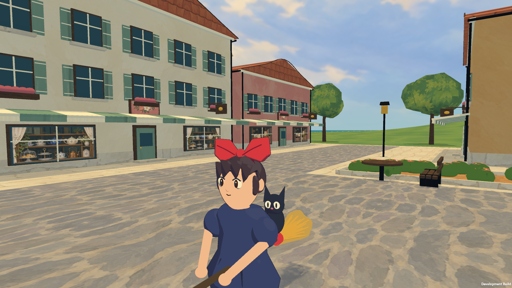

# Painted-film pass: native verification

2026-09-27. The [research and implementation notes](../../CEL_ART_PASS.md) explain which ideas from Wind Waker, Hi-Fi RUSH, Orbitals and Guilty Gear Xrd informed this pass. All images here are native Unity player captures; the generated texture atlases and Blender previews are documented separately.

## Intended flight experience

The connected bakery street leads to the clock square, opens onto the harbor and quay, then rises toward Madame's garden and the airship cargo court before returning home. The clock tower, roof colors and coast remain the navigation landmarks. Delivery coordinates, assisted approaches and maneuvering space are preserved. The player can cruise above the roofs and descend into clear courts with the existing keyboard or controller controls.

This pass concentrates on the current first district. It does not expand the town or claim to reproduce a canonical film map.

## Visual comparison

The two bakery images below use the same route start, camera, 06:01 time and 1920 × 1080 player resolution. Compare the bow silhouette, rider contrast, storefront interiors, joined paving, surface painting and clear space around the broom.

| Earlier prototype | Painted-film pass |
| --- | --- |
| [Bakery before](../1920x1080/01-bakery.png) | [Bakery after](flight/01-bakery.png) |

Other views: [bakery shopfront](art/02-bakery-front.png), [garden overlook](art/05-garden-overlook.png), [painted sea](art/06-painted-sea.png), [sunset](art/07-bakery-sunset.png), [night](art/08-bakery-night.png), [flight HUD](art/01-bakery-noon-hud.png), [kitchen controller navigation](flight/Kitchen-controller.png).

## Checks performed

- Unity 6000.3.20f1 / URP 17.3.0 compiled C# and Metal shaders and exported the universal Mac development player on the existing GPU-less Ubuntu VM. The scene builder validated six landing floors, four character orientation anchors and 73 collision meshes. VM software rendering is not used as performance evidence.
- The native Apple M1 Pro / Metal player passed all **18 gameplay checks** at **1920 × 1080**: a delivery; five slow, grounded landings; eight-hour sleep and energy restoration; ingredient purchase; recipe and coffee buff; continuous menu time; controller scrolling, upgrade purchase and rising; save serialization; supported scene shaders. See the exact [flight result](flight/result.txt).
- Eight fixed art captures cover the bakery, character, clock square, garden, sea, sunset and night. All scene shaders were supported. See the [art result](art/result.txt). These captures are visual evidence, not a traversal test or performance benchmark.
- `codesign --verify --deep --strict` passed. The app contains arm64 and x86_64 executables. Native runtime testing used arm64 only.
- A normal, non-test launch at **1440 × 900** opened the existing saved game and displayed the revised scene and HUD correctly; see the [window capture](native-launch-1440.png). The app was closed gracefully after inspection so its continuous clock would not keep consuming energy. This was a launch smoke check, not a second full route or a controlled save-recovery test.
- The refreshed `Builds/mac/Kiki-Delivery-Mac.zip` is 120.6 MiB and passed archive integrity verification.
- The previous prototype's 1440 × 900 gameplay run and 25 independent core checks remain baseline evidence; they are not presented as reruns of this art pass. The core rules were not changed.

The final 1080p route averaged **18.55 ms per frame**, approximately **54 fps**, versus 18.54 ms in the baseline. Peaks were **1,192 draw calls** and **2,144,426 triangles**. The frame cap, screenshots, stops and menus affect these figures. They do not establish stable 60 fps or a release-build benchmark; the added geometry still needs profiling and distance detail reduction.

## Issues caught and corrected

- A sea shader initially used a reserved HLSL identifier, producing the pink fallback on Metal despite Unity reporting a successful export. Renamed the identifier, verified the native result, and made the build script reject shader compiler errors.
- Lowered the new street forecourts so they meet rather than cover the road and sidewalk surfaces.
- Disabled shadow casting on the thin ground and road surfaces while retaining received shadows; this removed the distracting fine seam grid seen in the first native review.
- Corrected panorama texture derivatives across the longitude wrap, removing the bright dashed sky seam.
- Refined the bow, bangs, face normals and cloth marks after source and native reviews; adjusted Jiji's separation and grounded visual height.
- Moved temporary notices above the scene, reduced the landing prompt, and hid the empty parcel card to keep the character and broom visible.

The initial failed art review is retained under `first-review/` and is not final evidence.

## Assumptions and remaining work

The approved target is the downloadable desktop rebuild with a third-person camera. The previous public browser game was not modified. No Windows, Linux, mobile, iPad or browser build was tested in this pass. Synthetic controller events validate the code path, not physical controller comfort or mappings.

The project has original/generated art and user-authorized Kiki references, but no production character rig, animation library or bespoke film-quality architectural kit. The renderer is now explicitly divided between drawn foreground characters and painted scenery; simple anatomy, repeated facades, sparse gardens and uniform tree forms still limit the illusion. Source art and generation prompts are retained in the [asset record](../../ART.md).

The next art milestone is a single finished bakery block with distinctive rooflines, irregular layered foliage, expressive flight and landing animation, and ambient sound. Human camera/landing playtests, physical controllers, save-file restart recovery and release performance profiling remain outstanding.
