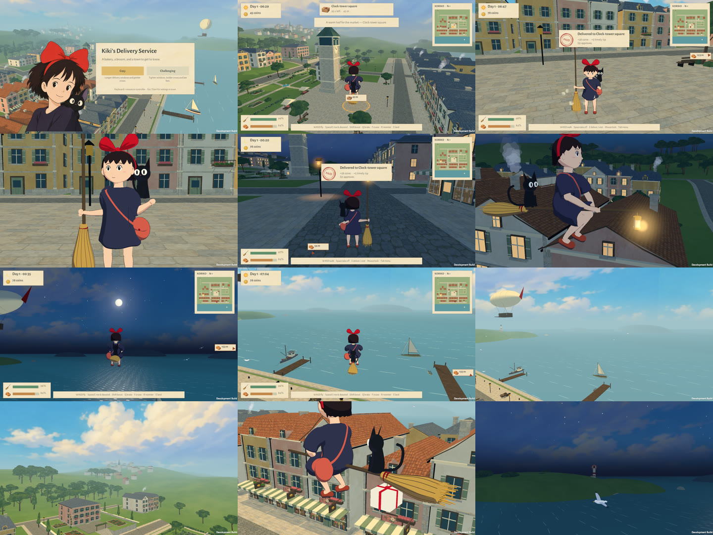

# Polish pass: native verification, September 30, 2026

The release `20260930-9679e3a` was built from source commit `9679e3a8c8247e9c81bfca50dbb434537bef162e` with Unity 6000.3.20f1. Both the Mac and Omarchy installations now run it. [Design and changes](../../POLISH_PASS.md). [Installation records](../../INSTALLATIONS.md).

From left to right, top to bottom:
1. Title flyover.
2. Flying toward the clock square with the paper tag over the ribbon circle.
3. The stamped receipt after a delivery.
4. The goodbye wave.
5. A lamplit street with lit households.
6. The moonlight lantern in flight.
7. The moon and its glitter path over the harbor.
8. Morning boats and islands.
9. The bay with headlands, the lighthouse and the airship.
10. The hill town in the haze.
11. A fragile parcel hanging from the broom.
12. The lighthouse at night.

All images are native captures. They were taken through the installed Mac Desktop shortcut at 1280 × 720 on an Apple M1 Pro with Metal.

## Completed checks

| Suite | Mac: Apple M1 Pro / Metal | Omarchy: RTX 3080 / OpenGLCore |
| --- | --- | --- |
| Polish tour: title, sound, parcel, tag, ring, delivery acting, night, harbor, horizon, settings and new game | [33 passed through the Desktop shortcut](mac-tour/result.txt) | [33 passed on the staged release](omarchy-tour/result.txt); [33 passed through the installed `kiki-delivery` launcher](omarchy-installed-tour/result.txt) |
| Keyboard, mouse, Xbox and PlayStation synthetic input, UI and camera | [46 passed](mac-controls/result.txt) | [46 passed](omarchy-controls/result.txt) |
| Walking, planted feet, carry, mount, flight and dismount | [17 passed](mac-walk/result.txt) | [17 passed](omarchy-walk/result.txt) |
| Six-court delivery route, bakery interactions and persistence | [25 passed](mac-flight/result.txt) | [25 passed](omarchy-flight/result.txt) |
| Airborne action, contact, cloth and smear regression | Not repeated on this platform | [10 passed; 762 sampled frames](omarchy-motion/result.txt) |
| Character study: carry, flight grip and cloth | [6 passed on the installed app](mac-character/result.txt) | Not repeated |
| Twelve environment viewpoints | [Captured on the installed app](mac-environment/result.txt) | Not repeated |
| Core rules, including the new delivery-receipt check | [27 passed](core-result.txt) | Same source |

The tour adds 33 assertions to the existing suites; the controls matrix grew from 45 to 46 checks. The route and walking suites were not otherwise changed.

The route averaged **16.88 ms/frame on the Mac** and **16.86 ms/frame on Omarchy**. Peak recorded draw calls were 2,036 on the Mac (the previous release recorded 2,032) and 6,440 on Omarchy (the previous release recorded 6,454). These runs include captures, menus and development-player overhead with the frame rate capped at 60, so they are not controlled benchmarks. The tour and walking suites use scripted warps or fixed capture timing and make no performance claim. The first staged Omarchy tour ran in a tiled 1896 × 1030 window. The later runs floated and sized only their own QA window, using Hyprland 0.56's Lua dispatchers, to a true 1280 × 720.

The motion regression reproduced the previous record exactly: 20 smear drawings across ten events, a longest exposure of 2/24 s, a peak of 26.32 m/s, banks from −21.1° to 24.4°, and hand and sole errors of 0.0000 m. This pass did not change Kiki's flight performance. Walking contact errors also remain at 0.0000 m.

## Defects found and fixed

- **Fog missing in every native player.** Graphics settings stripped fog variants automatically, and the generated scene was saved with fog off, so the runtime `RenderSettings.fog` had no shader to use. [Before (the September 28 environment capture)](fog-before-after/before-20260928-no-fog.png) shows saturated hills to the horizon. [After](fog-before-after/after-20260930-fog.png) shows the same viewpoint with aerial perspective.
- **Crows displaced by Kiki's smear drawings.** Crows shared her cel material, so the rider deformation reached them. Birds now use detached cel materials, and the tour asserts it.
- **Character study could not take off.** `--koriko-character-check` failed with "Character study takeoff blocked" on the *installed 20260929 release* as well. It is a harness bug: the study held Space in the first frame after closing the bakery, which the walking pass's menu guard correctly ignores. The study now releases the key for one frame, as a player would, and [passes](mac-character/result.txt).
- Review-driven revisions before the release candidate:
  - A reversed-winding canvas sack rendered as a black ball.
  - The hint strip overlapped the fullness readout at 16:9.
  - The delivery notice repeated the stamp's text, and a Jiji tip appeared on top of it.
  - Landing dust and delivery sparkles were too large; there is now no dust on the airship's deck.
  - The hand-over gesture was too subtle.
  - The headlands had perfectly elliptical coasts.
  - A tour study captured the previous frame's lighting.
  - The waltz's plucked strings carried DC offset. See the [low-frequency buildup before the fix](audio/waltz-spectrum-before-dc-fix.png) and the [spectrum after](audio/waltz-spectrum.png).

## Sound

The tour exports all 40 synthesized clips and their [levels](audio/levels.csv). Every clip is finite, audible and below clipping: peaks are 0.50–0.90 and no clip exceeds 0.99. Synthesis took about 0.52 s on the Mac and 0.58 s on Omarchy, off the main thread. At the tour's reduced master volume (35%), the title mix measured 0.036 RMS with a 0.127 peak at the listener on both platforms.

Listening copies (AAC, converted from the exported WAVs):
- [Title waltz](audio/waltz.m4a)
- [Twelve seconds of the final harbor-and-town mix recorded at the listener](audio/mix-harbor-and-town.m4a); [spectrum](audio/mix-spectrum.png)
- [Clock bell](audio/bell.m4a)
- [Gull](audio/gull0.m4a)
- [Cobble footstep](audio/stone0.m4a)
- [Delivery fanfare](audio/deliver.m4a)

**Nobody has listened to these sounds yet.** The levels, clipping, spectra and in-game triggers are verified; their taste and balance are not.

## Saves and installations

The QA modes never read or write saves or control preferences, so the players' saves were also checked directly. Read-only copies of both real saves [restore under the release's rules](save-compatibility.txt): the Mac save at day 33 with 20 coins, and the Omarchy save at day 1 with 45 coins. Both originals were unchanged after all runs: the Mac file's modification time is still September 27 and the Omarchy file's is still September 29.

- Mac:
  - `codesign --verify --deep --strict` passed, and the app is universal (x86_64 and arm64).
  - The new `Kiki-Delivery-Mac.zip` passed integrity testing: [SHA-256 and metadata](mac-release.json).
  - The previous release's archive was verified against its recorded SHA-256 before the swap and kept at `Builds/mac/previous/Kiki-Delivery-20260929-Mac.zip`. The September 28 archive remains alongside it.
- Omarchy:
  - All [275 release files](omarchy-file-hashes.json) matched their hashes, both after staging and again before the switch.
  - The player and `UnityPlayer.so` had no unresolved libraries, and the desktop entry validated.
  - `current` moved atomically to `releases/20260930-9679e3a`. The previous `20260929-49ba433` and `20260928-b093c2f` releases remain for rollback. [Metadata](omarchy-release.json).

## Limits

- No human listening test was run for the synthesized sound and music.
- No human flight-feel playtest or physical USB/Bluetooth controller test was run. Controller coverage remains synthetic Input System devices.
- No controlled GPU benchmark was run; the frame times above are route averages with overhead.
- There are no townspeople or court recipients. The hand-over is acted by Kiki alone.
- Browser, mobile/iPad, Windows and other GPUs were not tested.
