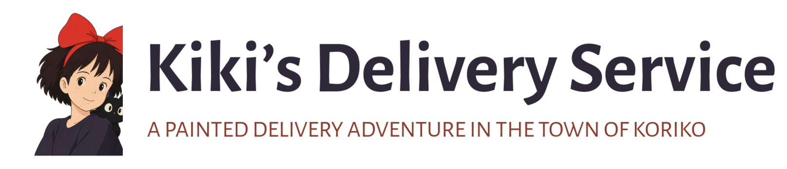
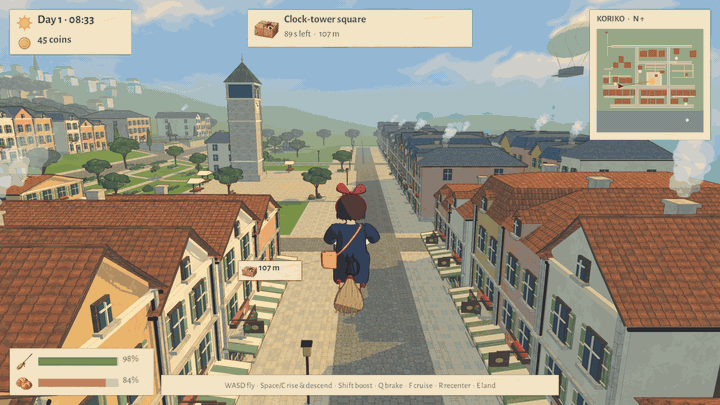
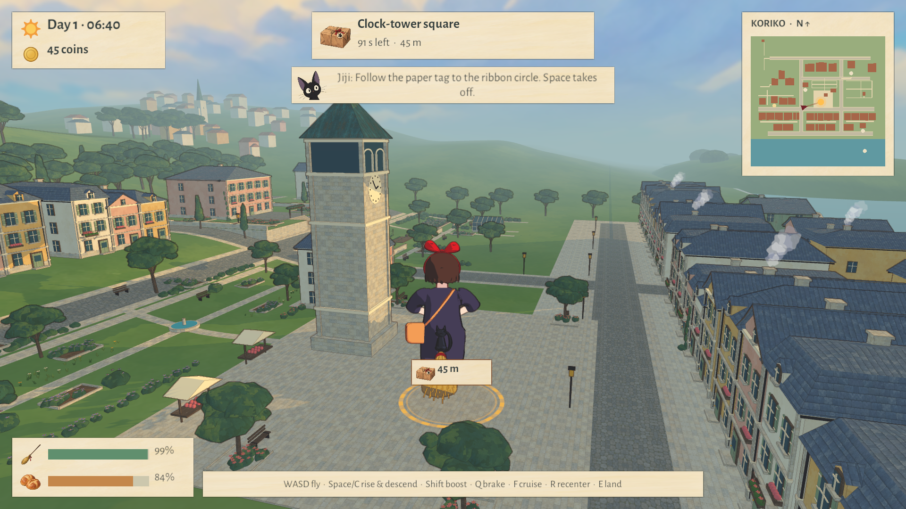
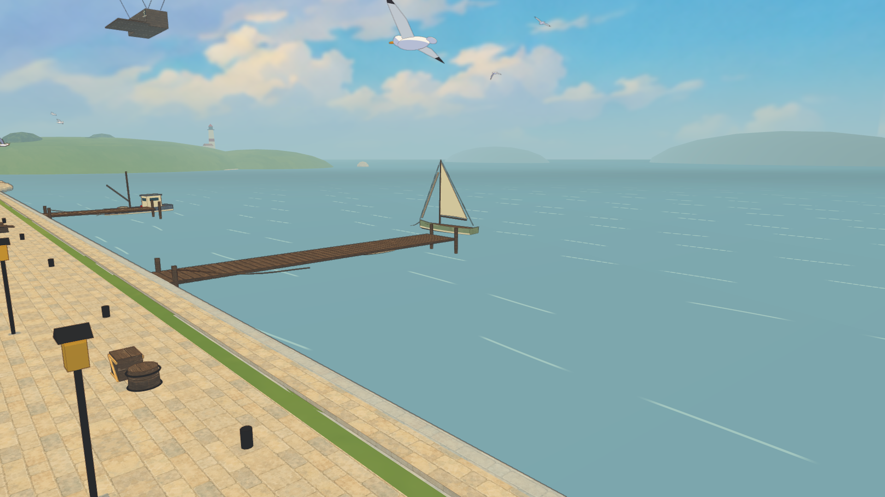
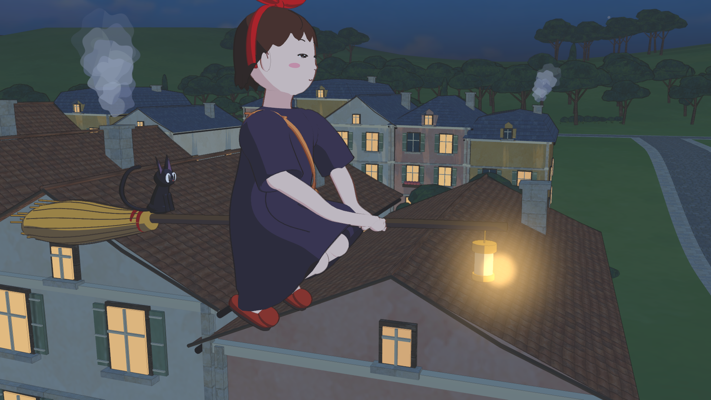

<p align="center"></p>

<p align="center"><b>A hand-painted delivery adventure through the seaside town of Koriko.</b><br>
Painted backgrounds, cel-shaded characters drawn on twos, and a broom that feels like the film's. An unofficial fan game made in Unity 6.</p>

<p align="center">
<a href="../../releases/latest"><b>⬇ Download for macOS · Windows · Linux</b></a> ·
<a href="#give-this-to-your-agent"><b>Install with your agent</b></a> ·
<a href="https://github.com/gazhenko/kikis-delivery-service/releases/download/v1.0.0/Kikis-Delivery-Service-trailer.mp4"><b>▶ Watch the trailer</b></a>
</p>

<p align="center"><a href="https://github.com/gazhenko/kikis-delivery-service/releases/download/v1.0.0/Kikis-Delivery-Service-trailer.mp4"></a></p>

| THE SHOPPING STREET | THE HARBOUR | LAMPLIGHT |
|---|---|---|
|  |  |  |

---

## What it is

**Kiki's Delivery Service** is a playable fan game built in Unity 6 (URP). You are Kiki, newly arrived in Koriko with Jiji on your shoulder and a room above Osono's bakery. Collect a parcel, walk out into the courtyard, push off on the broom, follow the paper tag over the rooftops, land inside the ribbon circle and hand it over. Fly home, shop, cook, fit a better broom and sleep. The town keeps its own time: a day and a night each last two and a half minutes.

The whole image is made to look like a painted film. Backgrounds are shaded in three flat washes with hard painted shadows and a painter's line; Kiki and Jiji are cels with one shadow shape per paint and coloured trace lines; her pose is drawn twelve times a second while the camera moves smoothly, and goes on ones for fast actions, as hand-drawn animation does. Every sound and the music are synthesized by the game.

### Features
- **Six delivery courts** in one connected district: Osono's bakery, the clock-tower square, the harbour post house, Madame's rose garden on the hill, Tombo's workshop and the cargo platform under the airship.
- **Jobs that need the right broom**: everyday parcels, Madame's porcelain, a rush before the bell, Tombo's heavy invention, a lantern across the water at night and special airship freight. Timely deliveries earn tips; a closed window costs the parcel (and a fee in Challenging).
- **Osono's bakery**: buy flour, milk, eggs, herring, mint and coffee; cook six recipes with buffs (a tailwind bun, Ursula's mint tea, Madame's herring pie); fit six broom upgrades (birch bristles, a cargo sling, a feather stabilizer, the moonlight lantern, a wind bell, the skyfarer's compass); sleep eight hours.
- **Walking and flight**: an upright broom carry, planted footsteps, mounting with a push-off, cruise, boost and braking, assisted landings on courts and clear streets, and crows to outrun.
- **A living town**: chimney smoke, gulls over the harbour, boats on the swell, lamplight and lit windows at dusk, stars and a moon with a glitter path on the sea, a lighthouse on the headland and a hill town in the haze.
- **Wayfinding**: a paper tag over the destination that clamps to the screen edge, a ribbon circle at the real delivery radius, a minimap and Jiji's tips.
- **Sound**: wind, sea, crickets, birds, gulls, crows, footsteps that change with the ground, bells from the clock tower and an original music-box waltz, all generated at startup with no recordings.
- Keyboard and mouse or Xbox and PlayStation controllers, with camera, sensitivity and sound settings. Cozy or Challenging pace. Local saves with a backed-up new game.

## Controls

| | Keyboard / mouse | Xbox | PlayStation |
|---|---|---|---|
| Walk / fly | WASD | Left stick | Left stick |
| Take off / rise | Space | A or RB | Cross or R1 |
| Descend | C or Ctrl | LB | L1 |
| Boost | Hold Shift | Hold RT | Hold R2 |
| Brake / hover | Hold Q | Hold LT | Hold L2 |
| Cruise | F | L3 | L3 |
| Recenter camera | R | R3 | R3 |
| Land · deliver · visit | E | X | Square |
| Bakery / settings | Tab | Y | Triangle |
| Back / settings | Escape | Start, B | Options, Circle |
| Look | Mouse (free, or hold right button) | Right stick | Right stick |

Near a delivery court or above a clear street, **E** starts an assisted landing; press it again, steer or brake to cancel. Deliveries need a slow, grounded landing inside the ribbon circle. **Settings ▸ Controls & camera** has sensitivity, dead zone, inversion, mouse-look and camera-follow options; **Settings ▸ Sound & display** has volumes, full screen and control hints.

## Installation

### Give this to your agent

Paste this into Claude Code, Codex, Cursor or any other coding agent that can run commands on your computer:

```text
Install Kiki's Delivery Service v1.0.0 on this computer from its official GitHub release, then tell me how to start it.

Release: https://github.com/gazhenko/kikis-delivery-service/releases/tag/v1.0.0
Download each file from https://github.com/gazhenko/kikis-delivery-service/releases/download/v1.0.0/<file>
  macOS, Apple Silicon or Intel  KikisDeliveryService-v1.0.0-macOS-universal.zip  contains "Kiki's Delivery Service.app"
  Windows 10/11, x64             KikisDeliveryService-v1.0.0-Windows-x64.zip      files at the zip root; the game is KikiDelivery.exe
  Linux, x64                     KikisDeliveryService-v1.0.0-Linux-x64.tar.gz     files at the archive root; the game is KikiDelivery.x86_64
  Checksums                      SHA256SUMS.txt

1. Detect the OS and CPU. If this computer is not one of the three platforms above (for example Windows or Linux on ARM), stop and tell me.
2. Check there is at least 1 GB free. Download the matching archive (about 80 MB) and SHA256SUMS.txt into a temporary folder with curl -L (curl.exe on Windows).
3. Compute the archive's SHA-256 and compare it with its line in SHA256SUMS.txt. If it does not match, delete the download and stop.
4. Install it, replacing any earlier Kiki's Delivery Service install at the same location:
   - macOS: run ditto -x -k <archive> ~/Applications so the app ends up at "~/Applications/Kiki's Delivery Service.app". The build is ad-hoc signed and not notarized; if the app carries a com.apple.quarantine attribute, remove it with xattr -dr com.apple.quarantine on the app.
   - Windows: create %LOCALAPPDATA%\Programs\KikisDeliveryService and extract into it (the zip has no top-level folder). Keep KikiDelivery.exe, UnityPlayer.dll, KikiDelivery_Data and MonoBleedingEdge together. Add a Start menu shortcut named "Kiki's Delivery Service" that points at KikiDelivery.exe.
   - Linux: create ~/Games/KikisDeliveryService and extract into it (the archive has no top-level folder). Run chmod +x KikiDelivery.x86_64 and add ~/.local/share/applications/kikis-delivery-service.desktop that launches it, with GameIcon.png as its icon. The game needs OpenGL 4.5 or Vulkan drivers.
5. Delete the downloaded archive and SHA256SUMS.txt.
6. Do not change system-wide security settings (Gatekeeper, SmartScreen, antivirus), and do not run anything else from the archive. Do not launch the game unless I ask. Finish by telling me where it is installed and how to start it.
```

### Manual install

Download the archive for your computer from the [latest release](../../releases/latest). Check it against `SHA256SUMS.txt` if you like (`shasum -a 256`, `sha256sum` or PowerShell `Get-FileHash`).

- **macOS** (Apple Silicon + Intel): unzip, right-click `Kiki's Delivery Service.app` → Open (the build is ad-hoc signed, not notarized). If macOS says it is damaged: `xattr -dr com.apple.quarantine "Kiki's Delivery Service.app"`.
- **Windows** (x64): extract the zip into a new folder and run `KikiDelivery.exe`. The Windows player is built from the same source as the others but has not been run on Windows yet; please report problems in an issue.
- **Linux** (x64): extract into a new folder with `tar -xzf KikisDeliveryService-v1.0.0-Linux-x64.tar.gz`, then `chmod +x KikiDelivery.x86_64 && ./KikiDelivery.x86_64` (OpenGL 4.5 or Vulkan).

The Windows and Linux archives have no top-level folder, so extract them into an empty folder of their own.

Saves and `Player.log` live in `~/Library/Application Support/com.Koriko.Kiki---s-Delivery-Service/` and `~/Library/Logs/Koriko/Kiki’s Delivery Service/` on macOS, `%USERPROFILE%\AppData\LocalLow\Koriko\Kiki’s Delivery Service\` on Windows and `~/.config/unity3d/Koriko/Kiki’s Delivery Service/` on Linux. Starting a new game copies the current save to `koriko-desktop-v1.before-new-game.json` first.

## Building from source

Requirements: Unity **6000.3.20f1** (6.3 LTS) with macOS, Windows and Linux Mono build support, Blender 4.5 (only to regenerate the models), .NET 8 (only for the rules checks), Python 3.

1. Open the folder in Unity. The scene `Assets/Koriko/Scenes/BakeryToHarbor.unity` is generated on first import from the authored FBX files; **Koriko ▸ Rebuild prototype scene** regenerates it.
2. **Koriko ▸ Build Mac / Windows / Linux prototype** exports a release player into `Builds/`. Batch builds: `Tools/build-on-vm.sh`, `Tools/build-windows-on-vm.sh` and `Tools/build-linux-on-vm.sh` run the same exports on a licensed build machine over SSH and reject shader errors.
3. `Tools/release.sh v1.0.0` packages the three players and the trailer with checksums and publishes a GitHub release.

Everything in the world is generated from code: `Tools/build_art.py` and `Tools/environment_art.py` build the town in Blender, `Tools/character_model.py` builds Kiki, Jiji and the broom, and `Assets/Koriko/Editor/SceneBuilder.cs` assembles the scene, materials and renderer. Run `blender --background --python Tools/build_art.py -- --character-only` or `-- --world-only` to rebuild one half.

### Checks
```sh
dotnet run --project Tests/Koriko.Core.Checks.csproj      # 27 rules checks, no Unity needed
```
A player accepts opt-in native checks that use the real input system, motor, camera and HUD and never touch saves: `--koriko-flight-check` (the six-court route), `--koriko-walk-check`, `--koriko-controls-check`, `--koriko-motion-check`, `--koriko-character-check`, `--koriko-environment-check`, `--koriko-tour-check` and `--koriko-trailer` (writes the trailer's frames). Results land in the game's data folder. See [Docs/DEVELOPMENT.md](Docs/DEVELOPMENT.md) and the design and verification records in `Docs/`.

## Tech notes
- URP Forward with 4× MSAA. `Koriko/Painted` shades the town in three flat washes whose boundary wobbles with the brush marks of the painted atlas, with hard-edged shadows that take the sky's blue; `Koriko/CharacterCel` gives each character paint one chosen shadow colour and a lit face; `Koriko/Ink` draws colour-matched inverted-hull trace lines sized in 1080p pixels; `Koriko/FilmEdges` is a full-screen pass (depth + normals) for the painter's line and the film grade; custom sky, sea, lamplight, smoke and court-ring shaders.
- Kiki's performance is procedural: timed action accents, damped overlapping springs for hair, bow, hem, satchel and Jiji, two-joint IK for hands on the broom and planted feet, analytic cloth contact, 1/24 s smear drawings, and a drawing clock that exposes poses on twos (ones for fast action) while planted feet stay exact.
- The town, characters and all surface atlases are original work; the atlases were generated from written prompts. No film assets are used. See [CREDITS.md](CREDITS.md).
- The trailer is captured in-engine at a fixed 24 fps by `--koriko-trailer` and cut with `Tools/make-trailer.sh`.

Kiki's Delivery Service is an unofficial fan project and is not affiliated with or endorsed by Studio Ghibli. Source code is MIT licensed; see [LICENSE](LICENSE) and [CREDITS.md](CREDITS.md).
